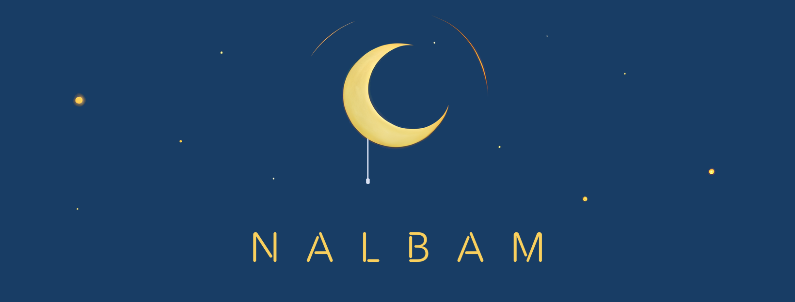

# Hi there, I'm nalbam (유정열) 👋

## 🧑🏻‍💻 About Me

AWS ML Hero로 선정된 **DevOps/SRE 6년 경력**의 인프라 전문가이자, **10년 이상의 백엔드 개발 경험**을 보유한 풀스택 엔지니어입니다.

백엔드 개발자로 시작하여 대규모 서비스 개발 및 운영 경험을 쌓은 후, DevOps/SRE 영역으로 전환하여 AWS 클라우드 인프라 설계, 구축 및 자동화 분야에서 깊은 전문성을 발휘하고 있습니다. Kubernetes 멀티 클러스터 환경 관리, CI/CD 파이프라인 구축, 모니터링 및 자동화 시스템 설계에 특화되어 있으며, 현재 당근마켓에서 대규모 트래픽을 처리하는 안정적인 인프라 운영을 담당하고 있습니다.

*   🥕 **DevOps / SRE** @ [Karrot (당근마켓)](https://www.daangn.com/)
*   🦸🏻 **AWS Machine Learning Hero** ([Profile](https://aws.amazon.com/ko/developer/community/heroes/jungyoul-yu/))
*   🏎 **AWS DeepRacer Championship 2019, 2020 Finalist** 🏁
*   💻 **10+ years Backend Development Experience** (Java, Spring, Node.js, PHP)

## 🛠️ Key Skills

### DevOps/SRE Core Skills (6년 경력)

### Backend Development Skills (10년+ 경력)

### Database & Tools

## 🚀 Highlight Projects

*   **[Toast](https://toastapp.io/)**: 생산성 향상을 위한 단축키 기반 앱/웹사이트/파일 실행 도구
*   **[AWS Colorful Navbar (Chrome Extension)](https://chromewebstore.google.com/detail/aws-colorful-navbar/kgifmgnlchjjippdpkblbdlfidcpceme)**: AWS 콘솔 리전별 네비게이션 바 색상 변경
*   **[Opspresso](https://opspresso.com)**: DevOps 자동화 도구 및 베스트 프랙티스 공유 ([GitHub](https://github.com/opspresso))

## 🎤 Community & Talks

*   **AWSKRUG (AWS Korea User Group)**: 다수 발표 ([#AIEngineering 소모임](https://www.meetup.com/awskrug/events/306528634/), [Gurumi 구현 방법](https://www.meetup.com/awskrug/events/303205066/), 등)
*   **당근마켓 SRE Meetup**: [쿠버네티스 멀티 클러스터 Addons 관리](https://youtu.be/tqyj1klizCU), [EKS 업그레이드](https://youtu.be/4Q8It_UvIws)
*   **AWS Hero Talk**: [re:Invent Daily Recap](https://youtu.be/Swz72QftVcU)
*   더 많은 발표 자료는 [nalbam/docs](https://github.com/nalbam/docs) 에서 확인하실 수 있습니다.

## 📊 GitHub Stats

